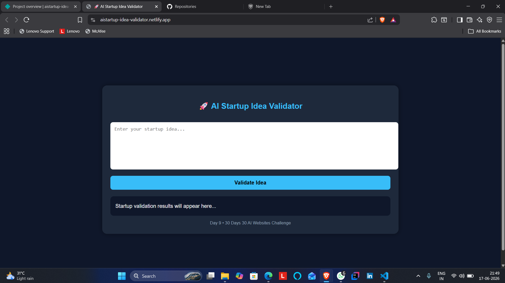
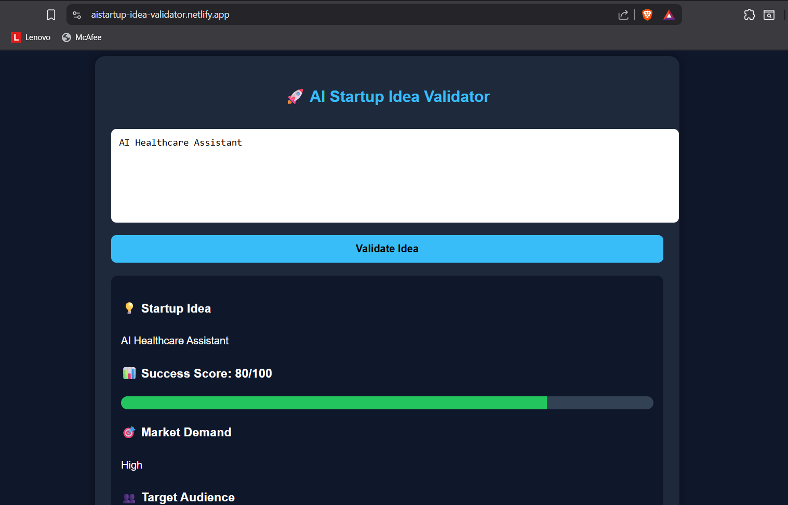
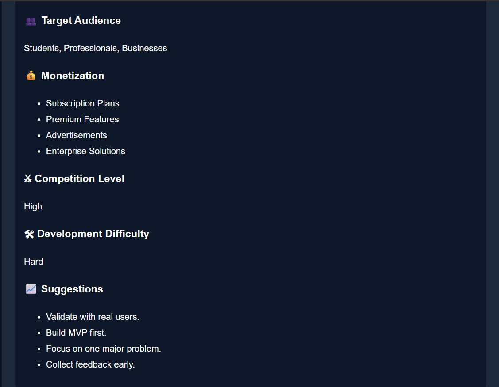

# AI Startup Idea Validator

🚀 Day 9 of my 30 Days 30 AI Websites Challenge

AI Startup Idea Validator is a web application that evaluates startup ideas and provides insights such as market demand, target audience, competition level, monetization opportunities, and success potential.

---

## 🌐 Live Demo

Demo Link:

https://aistartup-idea-validator.netlify.app/

---

## 📸 Screenshots

---

## Features

✅ Startup Idea Analysis

✅ Success Score Prediction

✅ Market Demand Estimation

✅ Target Audience Identification

✅ Competition Analysis

✅ Monetization Suggestions

✅ Development Difficulty Assessment

✅ Responsive UI

---

## Technologies Used

* HTML
* CSS
* JavaScript
* Built with the help of AI-assisted development tools
---

## How It Works

1. Enter a startup idea
2. Click Validate Idea
3. Receive:

   * Success Score
   * Market Demand
   * Target Audience
   * Competition Analysis
   * Monetization Suggestions
   * Development Difficulty
   * Startup Recommendations

---

## Example Ideas

* AI Resume Builder
* AI Healthcare Assistant
* Data Science Learning Platform
* Education Career Guidance System

---

## Challenge Progress

Day 1 ✅ AI Resume Analyzer

Day 2 ✅ AI Career Roadmap Generator

Day 3 ✅ AI Project Idea Generator

Day 4 ✅ AI Skill Gap Analyzer

Day 5 ✅ AI Interview Question Generator

Day 6 ✅ AI Portfolio Review Analyzer

Day 7 ✅ AI LinkedIn Post Generator

Day 8 ✅ AI Salary Predictor

Day 9 ✅ AI Startup Idea Validator

---

## Note

This project uses rule-based evaluation for startup idea analysis.

This project currently uses rule-based evaluation logic and is intended as a prototype. Future versions can integrate Gemini API or OpenAI API for more intelligent startup analysis.

---

## Author

Anand,

B.Tech CSE(Data Science)

30 Days • 30 AI Websites Challenge
